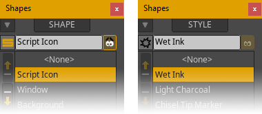
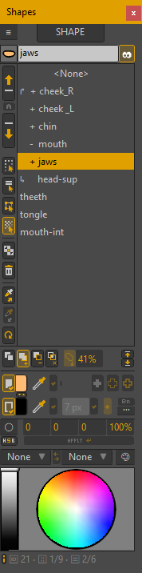
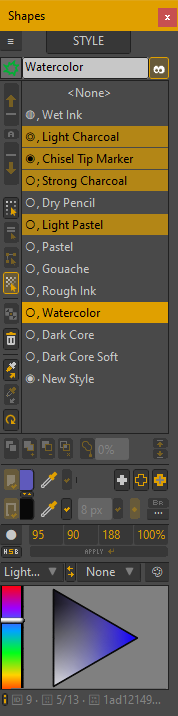
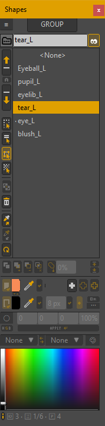
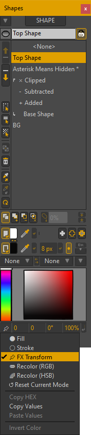
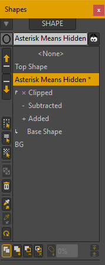
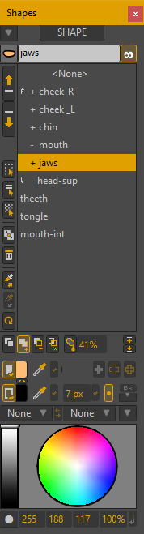
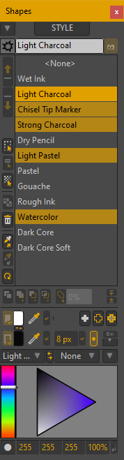

<table id="top" width="100%" border="0"><tr><td align="left" valign="middle" width="96">

</td><td align="right" valign="middle" width="1920" nowrap>

[![h-shield1-i]][h-shield1-a] [![h-shield2-i]][h-shield2-a] [![h-shield3-i]][h-shield3-a]
</td></tr></table>

# LS Shapes Window

Persistent shape palette plus helpers for better management of Moho® vectors in general and *Liquid Shapes* in particular. This script provides a visual and user-friendly interface for performing complex shape operations effortlessly.

 

## Gallery

<strong>UI</strong> (Expand/Collapse)  

 

<table align="center" border="0" class="gallery"><tr>
<td width="178" valign="top"><!-- width="1024px" for full width container-->

</td><td width="178" valign="top">

</td><td width="178" valign="top">

</td><td width="178" valign="top">

</td><td width="264" valign="top">

 Swatches")
</td><td width="178" valign="top">

</td>
</tr></table>

<!--

	

		&ensp;&ensp;
	

	 
	<table align="center" border="0" class="gallery">
		<tr>
			<td nowrap data-comment="Use width='1024px' for full width container">
				&ensp;
				&ensp;
				&ensp;
				&ensp;
				&ensp;
				
				 
			</td>
		</tr>
	</table>

-->
 

## Features

- Visualize layers' shape relationships at a glance.
- Take the most of *Liquid Shapes* thanks to improved management.
- Rename, reorder, hide/show, etc. one or several shapes with ease.
- New ways of shape creation independently of selected tool.
- Shape selection helpers: Select all, Inverse, Similar, Identical...
- Improved *Style* management, picking and modification.
- Improved *Point Group* management, reordering and modification.
- Many interactive "live" Swatches (and you can easily make your own).
- Recoloring features plus other helpers.
- Several window display modes to better suit your needs.
- And... much more!

 

## Installation

[**Download**][h-shield1-a] the file, **unzip** it, and proceed with the installation method of your choice...

| MANUAL                                                                          | ASSISTED                                                                        |
| ------------------------------------------------------------------------------- | ------------------------------------------------------------------------------- |
| 1. You'll get some of these folders:  `Menu / ScriptResources / Tool / Utility` | 1. In Moho®, go to "Scripts > Install Script…" to open the installation wizard* |
| 2. Place'em all into the *Scripts* folder of your [Custom Content Folder][3-1a] | 2. Click *Select A Script Folder*, browse to the uzipped folder & **select it** |
| 3. Restart Moho or press `Alt + Shift + Ctrl + L` to *Reload Tools And Brushes* | *  More details in chapter [23.17 Install Script…][3-2a] of Moho® user's manual |

And that's all! The script should appear in *Tools* palette and/or under *Scripts* menu.

> ⚠ **WARNING:** Please, make sure you have uninstalled every Lost Script on your system before removing any of these shared resources or they may start throwing errors or stop working. For uninstalling a script, just remove any file and folder matching its name and restart Moho® or Reload Tools And Brushes if necessary.

 

## Usage

1. **Opening**: Open *Shapes Window* from Moho's *Tools* palette or via its entry in the *Scripts* menu.
2. **Operating**: Now you can have it permanently open to perform various shape operations.
3. **Customizing**: Unfold Window's main menu: 🔽 (at top left of the window) to access different settings & actions.
4. **Tooltips**: If *Beginners Mode* is checked, holding the cursor over the different elements will give a hint of their functionality...

 

## Collab & Support

Suggestions and bugs can be reported in the [<i>Issues</i>](https://github.com/lost-scripts/ls_shapes/issues "Go to ''Issues'' section") section (preferably) or in the corresponding topic, if any, in [<i>Scripting</i>](https://www.lostmarble.com/forum/viewforum.php?f=12 "Go to Lost Marble Forum's ''Scripting'' section") section of the [<i>Lost Marble Forum</i>](https://www.lostmarble.com/forum "Go to the ''Lost Marble Forum''").

 

## Acknowledgments

My sincere thanks to...

- **Stanislav Zuliy** (Stan), for all his contributions & generosity.
- **Lukas Krepel**, for paving the *modeless* way 🙂
- **Mike Kelley**, for allowing me use the guts of his great *Adjust Colors* script.
- **Wes** (synthsin75), **Paul** (hayasidist) & **Sam** (SimplSam), for their support at the [LM forums](https://www.lostmarble.com/forum).
- **Copilot** & **ChatGPT**, for... erm... Why not? 🤷‍♂️

And, of course, to **Lost Marble** and the talented Moho® team for all the hard work and for making this all possible (again).

 

## Other...

- <a href="https://lost-scripts.github.io/scripts/ls_shapes" data-alt-href="https://github.com/lost-scripts/ls_shapes" data-alt-textContent="Shapes window repository" data-alt-title="Go to the Shapes Window repository...">Shapes Window webpage</a>
- [Lost Marble Forum topic](https://www.lostmarble.com/forum/viewtopic.php?t=36508 "Go to the Lost Marble Forum topic...")

---

[h-shield1-i]: https://img.shields.io/github/downloads/lost-scripts/ls_shapes/total?logo=data:image/svg%2bxml;base64,PHN2ZyB4bWxucz0iaHR0cDovL3d3dy53My5vcmcvMjAwMC9zdmciIHZpZXdCb3g9IjAgMCA1MTIgNTEyIj48cGF0aCBmaWxsPSIjZWVlIiBkPSJNMjg4IDMyYTMyIDMyIDAgMSAwLTY0IDB2MjQzbC03My03NGEzMiAzMiAwIDAgMC00NiA0NmwxMjggMTI4YzEzIDEyIDMzIDEyIDQ2IDBsMTI4LTEyOGEzMiAzMiAwIDAgMC00Ni00NmwtNzMgNzRWMzJ6TTY0IDM1MmMtMzUgMC02NCAyOS02NCA2NHYzMmMwIDM1IDI5IDY0IDY0IDY0aDM4NGMzNSAwIDY0LTI5IDY0LTY0di0zMmMwLTM1LTI5LTY0LTY0LTY0SDM0N2wtNDYgNDVhNjQgNjQgMCAwIDEtOTAgMGwtNDUtNDVINjR6bTM2OCA1NmEyNCAyNCAwIDEgMSAwIDQ4IDI0IDI0IDAgMSAxIDAtNDh6Ii8+PC9zdmc+&color=blue
[h-shield1-a]: https://github.com/lost-scripts/ls_shapes/releases/latest/download/ls_shapes.zip "Download latest version..."

[h-shield2-i]: https://img.shields.io/github/release/lost-scripts/ls_shapes?logo=github
[h-shield2-a]: https://github.com/lost-scripts/ls_shapes/releases/latest "Go to release in GitHub..."

[h-shield3-i]: https://img.shields.io/badge/for-Moho_Pro_14.3+_(Win)-orange
[h-shield3-a]: https://moho.lostmarble.com/ "Go to Moho® website..."

[3-1a]: https://manual.lostmarble.com/app/page/1bmBks7y8KPdbPd-ll9kQGPdZJfDf3Rq67BCp8F5Y-FI?p=1UxA8Gi5DttJku9AmFlSpO0gJw4U9flX3
[3-2a]: https://manual.lostmarble.com/app/page/1IOuEOfMa7kUwqYPi2ABDhwoWE_KXB1OBCC5ib__iyIE?p=1UxA8Gi5DttJku9AmFlSpO0gJw4U9flX3